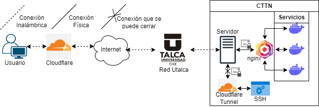

# Exposición de Servicios

En el contexto de la infraestructura de servidores, los servicios son funcionalidades o capacidades específicas que un servidor proporciona a los clientes o usuarios. Estos servicios pueden variar ampliamente según la naturaleza del servidor y las necesidades del sistema. En este informe, se explorará qué es un servicio en el contexto de los servidores y cómo se expone para permitir su acceso desde redes externas, como Internet.

## Definición de un servicio en un servidor

Un servicio en un servidor se refiere a una funcionalidad específica que el servidor ofrece a través de una interfaz de programación de aplicaciones (API) definida. Puede ser un servicio web, un servicio de base de datos, un servicio de autenticación, un servicio de procesamiento de imágenes, entre otros. Cada servicio tiene su propia lógica de negocio, que incluye operaciones y algoritmos específicos para llevar a cabo las tareas requeridas.

## Exposición de un servicio

Normalmente, cuando se implementa un servidor o servicio en una red local o entorno interno, este se encuentra inaccesible directamente desde Internet debido a cuestiones de seguridad y configuración de red. Sin embargo, en algunos casos, es necesario exponer un servicio para permitir su acceso desde redes externas. La exposición de un servicio implica realizar ajustes en la configuración del servidor y de la red para habilitar el acceso desde fuera de la red local.

### Configuración de puertos

La configuración de puertos es un paso fundamental para exponer un servicio. Los servicios en un servidor se comunican a través de puertos específicos, que actúan como puntos de entrada para las solicitudes entrantes. Al configurar un servidor para exponer un servicio, es necesario abrir los puertos correspondientes en el firewall y en la configuración de red para permitir que las solicitudes externas lleguen al servidor. Esto implica especificar los puertos de escucha del servicio y asegurarse de que estén abiertos y redirigidos correctamente hacia el servidor.

### Port Forwarding (Reenvío de puertos)

En muchos casos, el servidor se encuentra detrás de un enrutador o firewall que actúa como punto de entrada a la red. Para que las solicitudes externas lleguen al servidor, se debe configurar el port forwarding (reenvío de puertos) en el enrutador o firewall. El port forwarding implica redirigir las solicitudes entrantes desde un puerto específico en el enrutador o firewall hacia un puerto correspondiente en el servidor interno. Esto garantiza que las solicitudes externas sean enrutadas correctamente al servicio deseado en el servidor.

### Medidas de seguridad

Es importante tener en cuenta que al exponer un servicio, también se deben considerar las medidas de seguridad necesarias para proteger el servidor y el servicio expuesto. Esto implica implementar medidas como autenticación, cifrado de datos y configuraciones de seguridad adicionales para evitar accesos no autorizados y posibles vulnerabilidades.

## Servidor CTTN

Dado todo lo explicado en el apartado anterior y contextualizándose al servidor del CTTN, los servicios que se quieren exponer, se dividen en dos sectores:

- [Privados](#servicios-privados): Aquellos servicios los cuales necesitas acceso como un administrador sin estar físicamente en el servidor.
- [Públicos](#servicios-públicos): Aquellos servicios los cuales están expuestos para el público general y sean usados.

Debido a que el servidor del CTTN utiliza la red de UTALCA, se ha configurado con su propia IP pública, y solo se exponen los servicios HTTP (puerto 80) y HTTPS (puerto 443). Debido a esta configuración, no es posible acceder a otros servicios, como SSH, que el servidor dispone fuera de la red de UTALCA. El puerto HTTP (Hypertext Transfer Protocol) y el puerto HTTPS (HTTP Secure) son puertos estándar utilizados para la comunicación entre los clientes (navegadores web) y los servidores web.

1. **Puerto HTTP (puerto 80)**: El puerto 80 es el puerto predeterminado utilizado para las conexiones HTTP no seguras. HTTP es un protocolo de aplicación utilizado para transferir datos y contenido web desde un servidor a un cliente, como un navegador web. El tráfico HTTP no está encriptado, lo que significa que la información transmitida, incluyendo las solicitudes y respuestas, se envía en texto plano y puede ser interceptada y leída por terceros.
2. **Puerto HTTPS (puerto 443)**: El puerto 443 es el puerto predeterminado utilizado para las conexiones HTTPS seguras. HTTPS es una versión segura de HTTP que utiliza el protocolo SSL/TLS (Secure Sockets Layer/Transport Layer Security) para encriptar el tráfico entre el cliente y el servidor. Esto proporciona una capa adicional de seguridad y privacidad, ya que los datos transmitidos están cifrados y no pueden ser fácilmente interceptados o modificados por terceros.

### Servicios Privados

Para solucionar este problema, se utiliza [Cloudflare Tunnel](https://www.cloudflare.com/products/tunnel), una herramienta proporcionada por Cloudflare que permite exponer servicios en servidores internos o locales de manera segura a través de la red de Cloudflare e Internet. Con Cloudflare Tunnel, se puede establecer una conexión segura y encriptada entre tu servidor interno y los servidores de Cloudflare en la nube, lo que permite exponer servicios de manera segura a través de la red de Cloudflare.

[Cloudflare Tunnel](https://www.cloudflare.com/products/tunnel) utiliza un cliente llamado `cloudflared` que se ejecuta en tu servidor interno y establece una conexión segura saliente con los servidores de Cloudflare. Esta conexión segura se mantiene activa y se utiliza para enrutar el tráfico entre Internet y tu servidor interno a través de la red de Cloudflare.

Una vez que la conexión se ha establecido, [Cloudflare Tunnel](https://www.cloudflare.com/products/tunnel) asigna una URL única al servicio, utilizando el subdominio de elección en un dominio ya registrado. Esto permite acceder a al servicio a través de esta URL asignada, y Cloudflare se encarga de enrutar el tráfico entrante a través de la conexión segura hacia el servidor interno.

[Cloudflare Tunnel](https://www.cloudflare.com/products/tunnel) es especialmente útil en escenarios donde se necesita exponer servicios internos de manera segura, como aplicaciones web, APIs, servidores de bases de datos, entre otros. Proporciona una forma conveniente y segura de acceder a estos servicios sin tener que exponer directamente tu red interna a Internet.

[Cloudflare Tunnel](https://www.cloudflare.com/products/tunnel) se está usando específicamente para servicios importantes como SSH (Secure Shell). Es un protocolo de red que permite el acceso remoto y seguro a través de una conexión cifrada. SSH proporciona una forma segura de autenticación y comunicación entre dispositivos, y se utiliza ampliamente en entornos de administración de sistemas y redes.

Al utilizar [Cloudflare Tunnel](https://www.cloudflare.com/products/tunnel) para servicios críticos como SSH, se puede aprovechar las características de seguridad y rendimiento de la red global de Cloudflare, como lo puede ser doble autentificación, además de ocultar la dirección IP real de tus servidores internos y una configuración rápida y simple para el acceso remoto a a servicios importantes donde luego se pueden cerrar.

En resumen, [Cloudflare Tunnel](https://www.cloudflare.com/products/tunnel) es una solución sencilla y segura para enrutar el tráfico a través de HTTPS, especialmente si estás buscando una implementación rápida y no tienes necesidades de configuración y personalización muy complejas.

### Servicios Públicos

Por supuesto, aquí tienes una versión reescrita del párrafo:

Cuando se ejecuta un servicio localmente, este ocupa un puerto en la red local. Sin embargo, debido a la limitada disponibilidad de puertos comunes para exponer el servicio al público externo, se requiere un servicio de Proxy. Este servicio actúa como intermediario monitorizando los puertos HTTP y HTTPS, redirigiendo el tráfico hacia otros servicios y permitiendo así la comunicación externa.

Con el fin de abordar esta necesidad, se ha decidido utilizar [Nginx Proxy Manager](https://nginxproxymanager.com).. Esta herramienta simplifica la configuración y gestión de proxies inversos utilizando el servidor web Nginx. A través de su interfaz gráfica de usuario, se pueden establecer reglas para enrutamiento del tráfico HTTP y HTTPS hacia los servicios correspondientes, facilitando la exposición de los servicios locales al exterior.

En resumen, [Nginx Proxy Manager](https://nginxproxymanager.com). se utiliza como un servicio de Proxy que monitorea y redirige el tráfico de los puertos HTTP y HTTPS hacia los servicios locales, permitiendo así la comunicación con el público externo. Su elección se debe a la limitada disponibilidad de puertos comunes para exponer directamente los servicios al exterior.

Si bien como se mencionó en la sección anterior [Cloudflare Tunnel](https://www.cloudflare.com/products/tunnel) ya realiza este proceso de una manera sencilla y rápida junto con una conexión segura. Al utilizar un proxy inverso se puede tener un mayor control y flexibilidad sobre la configuración, así como un rendimiento directo y una menor latencia, ya que el tráfico se enruta directamente desde el cliente al servidor.

Esta combinación de [Cloudflare Tunnel](https://www.cloudflare.com/products/tunnel) y [Nginx Proxy Manager](https://nginxproxymanager.com) permite aprovechar las fortalezas de cada solución en función de tus necesidades específicas.

Por otra parte [Cloudflare Tunnel](https://www.cloudflare.com/products/tunnel) puede ser cerrado desde el servidor o directamente desde mi cuenta personal. Por lo que cuando ya no sea necesario que tenga acceso directo al servidor este puede ser eliminado.

# Despliegue de Smart-Mesck

Para realizar la aplicación de Smart-Mesck se dividió en más de una aplicación. A continuación, se explicará cómo construir y ejecutar estas aplicaciones sin tener problemas debido a configuraciones o credenciales que puedan faltar.

- [Smart-Mesck-UI](#smart-mesck-ui): Esta es la interfaz gráfica de la página web, que se encarga de proporcionar una experiencia amigable para el usuario. La UI se comunica con la API para obtener los datos necesarios y mostrarlos al usuario de manera adecuada.
- [Smart-Mesck-API](#smart-mesck-api): Esta es la aplicación web API que se encarga de la mayor parte de la lógica de la aplicación. La API es responsable de procesar las solicitudes de la UI, comunicarse con la base de datos y proporcionar los datos solicitados a la UI.
- [Smart-Mesck-Graph](#smart-mesck-graph): Esta es una aplicación web con el único objetivo de poder graficar los datos.

En conjunto, la UI y la API trabajan en conjunto para crear una aplicación funcional y amigable para el usuario. La UI se encarga de la presentación y la interacción con el usuario, mientras que la API maneja la lógica y la comunicación con la base de datos.

