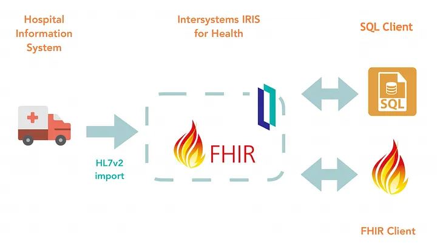

# Servidores FHIR

Cómo se sabe, FHIR es un estándar de interoperabilidad de datos para el intercambio de datos de atención médica, pero FHIR en si solo un estándar y no nos permite desarrollar aplicaciones interoperables. Para utilizar FHIR en todo su potencial y utilizar aplicaciones de desarrollo de FHIR necesitaríamos algún habilitador que nos permita utilizar e interactuar con FHIR. Sin el habilitador, FHIR sería como la documentación de un lenguaje de programación sin ninguna forma de implementar o utilizar ese lenguaje de programación. FHIR Server es uno de esos facilitadores para FHIR.

Los servidores FHIR son herramientas clave para la interoperabilidad de los datos de salud. FHIR, como habilitador, proporciona diferentes funcionalidades para desarrollar aplicaciones utilizando FHIR. Diferentes servidores FHIR pueden proporcionarle diferentes funciones, pero la funcionalidad básica incluye:

1. **Almacenamiento de datos**: dado que FHIR proporciona modelos/recursos de datos personalizados, sería una tarea muy difícil implementar un almacén de datos personalizado para almacenar objetos FHIR. Por este motivo, los servidores FHIR proporcionan la implementación para el almacenamiento de datos FHIR. Diferentes servidores FHIR pueden proporcionar diferentes implementaciones para los almacenamientos de datos FHIR y pueden usar SQL o No-SQL para la implementación subyacente.

1. **API Rest de FHIR**: las especificaciones FHIR también definen la especificación de las API Rest para la interacción con los recursos de FHIR. El servidor FHIR proporciona la implementación de estas API Rest de FHIR y formas estandarizadas de interactuar con el almacenamiento de datos subyacente de FHIR.

1. **Validación de perfil**: otra característica importante que proporciona la mayoría del servidor FHIR es la validación de perfil para el recurso. El recurso FHIR en sí mismo es muy amplio y debemos limitar estos recursos a nuestras necesidades y esto se logra utilizando perfiles. El servidor FHIR proporciona funciones para la validación de los recursos FHIR antes de agregarlos al almacenamiento de datos. De esta manera, podemos asegurarnos de que cada recurso FHIR se ajuste al perfil dado.

1. **UI para interacción**: la mayoría de los servidores FHIR también vienen con una UI simple para una fácil interacción de los recursos y API de FHIR. Esta interfaz de usuario proporciona una de las mejores formas de ejecutar e interactuar con las API y los recursos de FHIR y ver los cambios a medida que se realizan.

Existen diferentes servidores FHIR disponibles, tanto de código abierto como de soluciones patentadas, para los principales proveedores de la nube.

## Open Source

Estas son soluciones e implementaciones de uso gratuito de los servidores FHIR. Estas soluciones le proporcionarán funciones básicas sobre las cuales podrá desarrollar sus propias soluciones personalizadas. Estos se consideran buenos puntos de partida para desarrollar su propia aplicación utilizando las especificaciones FHIR. A continuación se muestran algunos ejemplos:

1. [HAPI FHIR](https://hapifhir.io)
1. [LinuxForHealth FHIR](https://linuxforhealth.github.io/FHIR/)

## Pagadas

A diferencia de las soluciones de código abierto mencionadas anteriormente, estas no son de código abierto ni de uso gratuito, pero a cambio le brindan mucha más funcionalidad que las soluciones de código abierto, como la capacidad de realizar análisis en la tienda FHIR para generar predicciones futuras. Son útiles para desarrollar soluciones avanzadas que admitan las especificaciones FHIR. A continuación se muestran algunos ejemplos:

1. Google FHIR store
1. Azure FHIR services
1. AWS FHIR APIs