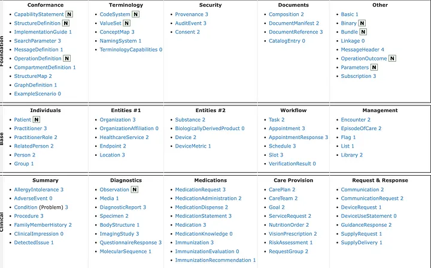
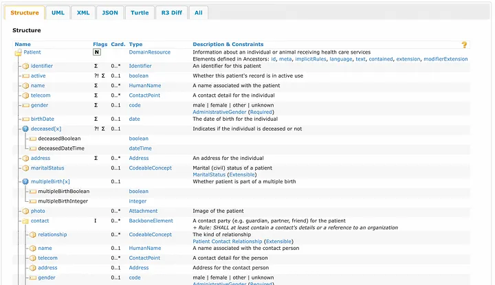
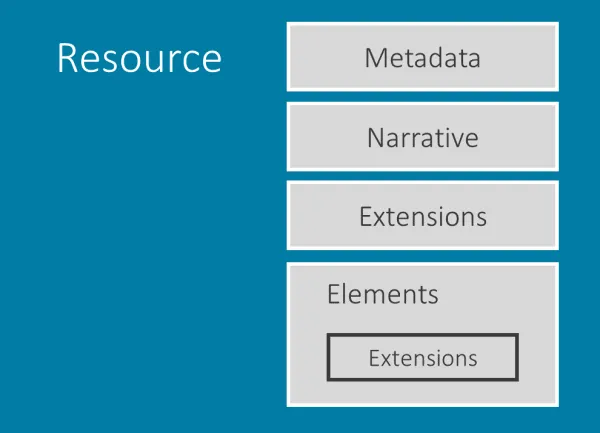

# Recursos FHIR

Los recursos son los componentes básicos del estándar FHIR. Básicamente se recoge de la especificación HTTP que básicamente define todo y los recursos direccionables. FHIR básicamente define un registro de salud como la recopilación de recursos. por ejemplo, el Registro médico puede almacenar la información de la condición del paciente, en FHIR esto puede almacenarse como el recurso Condición y paciente. Cada recurso se puede representar en diferentes formas como XML y JSON. Algo que lo hace ideal para aplicaciones API REST.

# Data Models/Resources

Cada recurso en FHIR tiene una narrativa y un caso de uso por detrás. Una narrativa en FHIR puede representar una situación, algunos actores y otras entidades relacionadas con la salud. Para empezar, FHIR define una amplia variedad de recursos. Para saber más de estos, existe su [documentación](https://www.hl7.org/fhir/resourcelist.html) proporcionada por HL7.

Los recursos más importantes para cada servicio clínico podrían considerarse los siguientes:

1. **Patient**: Persona que recibe el servicio de atención médica.

1. **Condition**: Representa la condición de un paciente.

1. **Observations**: Representa los informes diagnósticos del paciente.

1. **Appointment**: Representa la visita de un paciente a una clínica.

1. **Name**: el nombre del elemento en el recurso.

1. **Flags**: un conjunto de información sobre el elemento que afecta la forma en que los implementadores los manejan. por ejemplo: $\sum$ representa que el elemento está incluido en la búsqueda resumida.

1. **Cardinality**: los límites inferior y superior de cuántas veces se permite que este elemento aparezca en el recurso.

1. **Type**: el tipo de datos del elemento. Estos pueden ser tipos simples como cadenas o tipos complejos como referencias a otros recursos.

1. **Description & Constraints**: una descripción del elemento y detalles sobre las restricciones que se le aplican.

Cada recurso en FHIR puede constar de las siguientes partes:

1. **Metadata**: proporciona información adicional sobre el recurso, por ejemplo: ResourceId, versión del recurso, perfiles y etiquetas.

1. **Narrative**: versión legible por humanos del contenido.

1. **Extensions**: Esto se utiliza para implementar atributos que un recurso no contiene pero es necesario para la institución clínica.

1. **Elements/Body**: Representa los recursos de contenido reales.

# FHIR Profiles

Sabemos que el concepto básico de FHIR es que todo está representado como recursos. Estos recursos pueden ser muy amplios y un atributo en un recurso puede representarse de varias maneras.

Entonces, para fomentar la interoperabilidad, es posible que deseemos limitar los recursos de acuerdo con nuestras propias especificaciones y limitaciones. Ahí es donde la creación de perfiles entra en escena.

En resumen, **El perfil FHIR** es una forma de limitar los recursos de FHIR para cumplir con ciertos estándares definidos. Es una especie de esquema de datos para el recurso FHIR.

**//TODO**: Investigar más de este asunto en cómo implementarlos. 