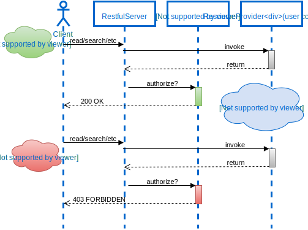

# Seguridad

En términos de seguridad, este sistema utiliza autentificación basada en JWT, o JSON Web Tokens. Un JWT es una forma segura de representar reclamaciones que se pueden transferir entre dos partes. En el contexto de la autentificación, después de que un usuario inicia sesión con sus credenciales, el servidor crea un JWT que contiene información identificativa del usuario y lo envía de vuelta al usuario.

Este token se incluye luego en el encabezado de cada solicitud que el usuario hace al servidor. Cuando el servidor recibe una solicitud, puede verificar el JWT para confirmar que el usuario es quien dice ser y proporcionar acceso a los recursos solicitados. Este método de autentificación es seguro y eficiente, y es ampliamente utilizado en aplicaciones web modernas.

Un JWT se compone de tres partes: el encabezado, la carga útil y la firma. El encabezado y la carga útil o también conocido como payload contiene información conciderada importante, mientras que la firma se utiliza para verificar que el token no ha sido alterado en tránsito. Juntos, estos tres componentes proporcionan una forma robusta de autentificar a los usuarios y proteger los recursos del servidor.

Por lo tanto, la seguridad de este sistema se basa en gran medida en la autentificación basada en JWT para garantizar que solo los usuarios autenticados puedan acceder a ciertos recursos.

El payload de un JWT es la parte del token que contiene las "afirmaciones" o declaraciones. En este caso, el payload contiene tres afirmaciones: id, role y exp.

id: Esta afirmación contiene el ID del usuario. Este es un identificador único que se utiliza para identificar al usuario en la aplicación. Por ejemplo, si el ID del usuario es "1234", el payload podría verse así: "id": "1234".

role: Esta afirmación contiene el rol del usuario. Este es un valor que indica qué permisos tiene el usuario en la aplicación. Por ejemplo, si el usuario es un paciente, el payload podría verse así: "role": "Patient".

exp: Esta afirmación contiene la fecha de expiración del token. Este es un valor numérico que representa el número de segundos desde la época de Unix (1970-01-01T00:00:00Z UTC) hasta la fecha/hora en que el token debe expirar. Por ejemplo, si el token debe expirar el 1 de enero de 2023 a las 00:00:00 UTC, el payload podría verse así: "exp": 1672444800.

Por lo tanto, un ejemplo de un payload de JWT para este proyecto podría ser:

``` json
{
    "id": "1234",
    "role": "Patient",
    "exp": 1672444800
}
```

Este payload indica que el token pertenece a un usuario con ID "1234", que el usuario es un paciente y que el token expira el 1 de enero de 2023 a las 00:00:00 UTC.


## Smart Mesck Web

Dado que Smart Mesck Web funciona como el [cliente FHIR](/FHIR/fhirclient/#conexion) Este se comunica primero con el [módulo de autentificación](servicios/#server-nombre-pendiente), utilizando las credenciales del usuario, este responderá un JWT para ser usado en en [HAPI FHIR](servicios/#hapi-fhir).

## Autorización en HAPI FHIR

HAPI FHIR no cuenta con una forma de autentificación integrada por lo que fue necesario agregar una para manejarlo junto a las reglas de acceso y visibilidad de recursos.

Internamente funciona como un Interceptor, el cual intercepta todas las solicitudes al servicio para verificar que estos contengan la autentificación correcta y decidir si puede acceder o no a lo que está solicitando.

