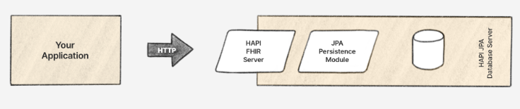

# Servicios

## Smart Mesck Web

Smart Mesck Web es la interfaz de usuario de la plataforma. En términos sencillos, es la página web con la que interactúas cuando usas el servicio. Es la cara de nuestro servicio, donde los usuarios y profesionales pueden interactuar de manera visual y amigable. Por último actua como el cliente FHIR para poder realizar todas las consultas necesarias.

## Server (nombre pendiente)

Este es el servicio el cual contiene lógica de la aplicación la cual es totalmente en el servidor. Este se utiliza para las siguientes funciones:

 - **Auntentifiación**: Este servicio se encarga de registrar y autentificar los usuarios que utilizarán el sistema.
 
 - **Graficar**:  Esta servicio se encarga de crear representaciones visuales de los datos.

## HAPI FHIR

HAPI FHIR, producto de la empresa Smile CDR, es una implementación de código abierto
de la especificación HL7 FHIR para Java. Es una aplicación que permite intercambiar datos
clínicos de una forma moderna y fácil de ser implementada por los desarrolladores; esta
aplicación está diseñada con una intención principal: Proveer un modo flexible de añadir
características FHIR al funcionamiento.

HAPI FHIR proporciona una serie de mecanismos para implementar un servidor FHIR, en este caso se utiliza:

 - **JPA Server**: El servidor HAPI FHIR JPA es una implementación completa de FHIR
contra una base de datos relacional; a diferencia del servidor simple, el servidor JPA
proporciona su propio esquema de base de datos y gestiona toda la lógica de
almacenamiento y recuperación sin necesidad de de codificación.

### Autentificación

Se añadió manualmente al poryecto un módulo extra especificamente para manejar la autentificación y permisos.